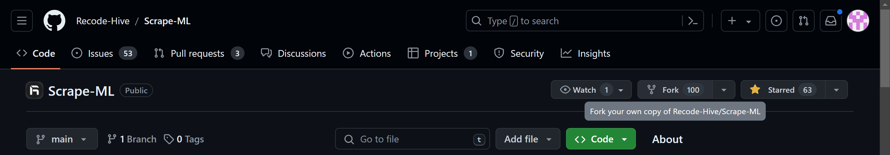
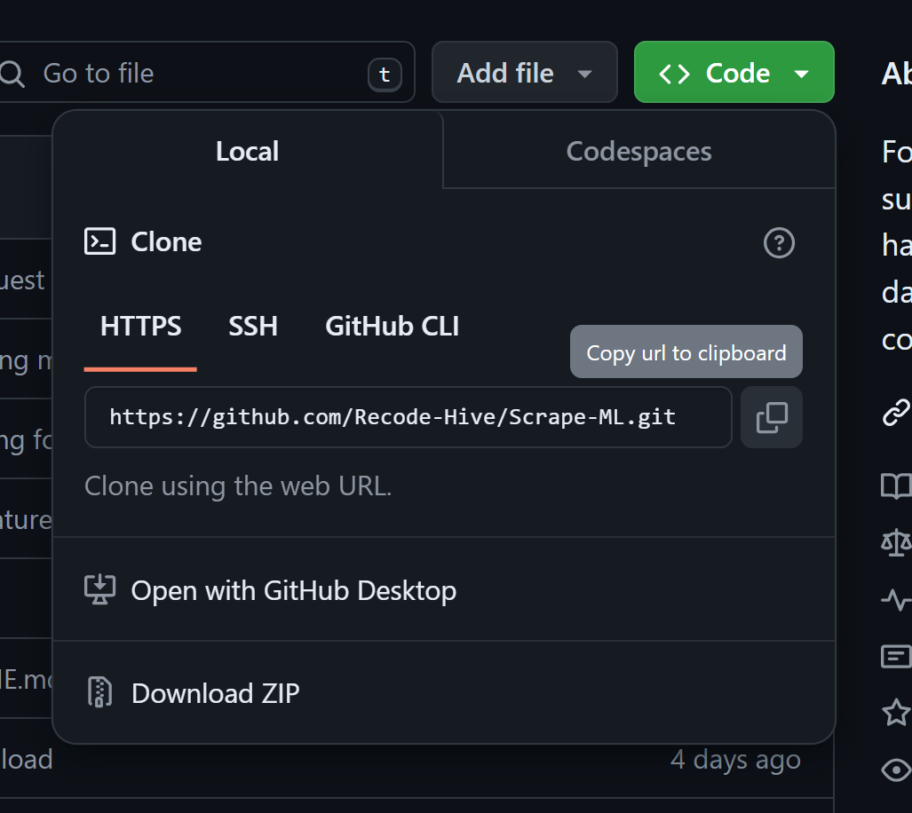
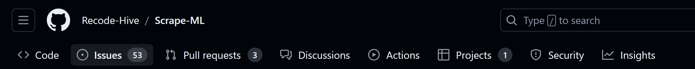

# LEARN.md

## Introduction
Welcome to the IMDb Movie Review Scraper project! This guide is designed to help beginners understand how to start and work on this project. Follow the steps below to set up the project, run the scraper, and use the data for analysis.📈

## Prerequisites
Before you begin, make sure you have the following software installed on your computer:

- Python 3.x: [Download and install Python](https://www.python.org/downloads/)
- Git: [Download and install Git](https://git-scm.com/downloads)

You will also need to install some Python libraries, which we will cover in the installation steps.

## Installation

### Step 1: Fork the Repository
Fork the `Semi-supervised-sequence-learning-Project` repository to your own GitHub account. This will create a copy of the repository under your GitHub account, which you can modify without affecting the original project.

Follow these instructions to fork a repository: [GitHub Forking Guide](https://docs.github.com/en/github/getting-started-with-github/fork-a-repo)



### Step 2: Clone the Repository
After forking the repository, clone it to your local machine. You can do this using SSH or HTTPS.

#### Using SSH
```bash
git clone git@github.com:your-username/Semi-supervised-sequence-learning-Project.git 
```
#### Using HTTPS
```bash
git clone https://github.com/your-username/Semi-supervised-sequence-learning-Project.git
```

### Step 3: Navigate to the Project Directory
Change into the project directory using the cd command:
```bash
cd Semi-supervised-sequence-learning-Project
```
### Step 4: Install Dependencies
The project requires some Python libraries. Install them using pip:
```bash
pip install beautifulsoup4 pandas
```
If you encounter any issues, make sure you have pip installed and are using the correct version of Python.
## Usage

### Scraping Movie Reviews 📊
The script `Movie_review_imdb_scrapping.ipynb` is used to scrape movie reviews from IMDb.

1. Open the Jupyter Notebook file `Movie_review_imdb_scrapping.ipynb`.
2. Follow the instructions in the notebook to scrape movie reviews. The script uses BeautifulSoup to extract data from IMDb's web pages.
3. Customize the scraper to target specific time periods, ratings, or other parameters as needed.

### Running the Streamlit App
The project includes a Streamlit app for a more interactive experience.
1. Navigate to the Web_app directory:
```bash 
cd Web_app
```
2. Install the requirements:
```bash 
pip install -r requirements.txt
```
3. Run the Streamlit app:
```bash
streamlit run streamlit_app.py
```

### Uploading the CSV File 📁
The Streamlit app allows you to upload a CSV file containing the reviews for analysis.

1. When prompted by the app, upload your CSV file.
2. The app will process the file and display the results.

### Customizing the Scraper 🛠️
You can customize the scraper to target different movies, time periods, or review ratings. Edit the script in `Movie_review_imdb_scrapping.ipynb` to suit your needs.


## Creating an issue
If you encounter any issues, feel free to open an issue on GitHub. We are happy to assist with any problems or inquiries you may have.

## Contributing
🎉Contributions are welcome! If you have any suggestions for improvements or new features, feel free to submit a pull request on GitHub. Your contributions help make this project better for everyone.



## Final Dataset
The final dataset containing the scraped IMDb movie reviews can be accessed from the provided [Drive link](https://drive.google.com/file/d/1sTNAeuy-99Hao0V5AOVznLXyDJC2zuFn/view). This dataset can be used for various analysis and research purposes.

## Conclusion
Thank you for using the IMDb Movie Review Scraper project. We hope this guide helps you get started and successfully scrape and analyze movie reviews. Happy coding!
## 🙏 Support

This project needs a ⭐️ from you. Don't forget to leave a star ⭐️